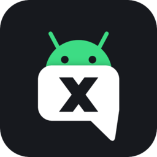
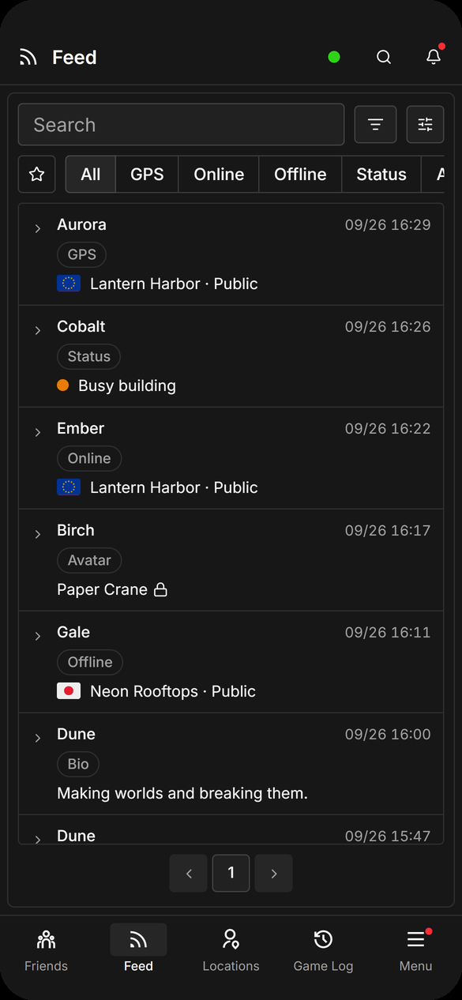
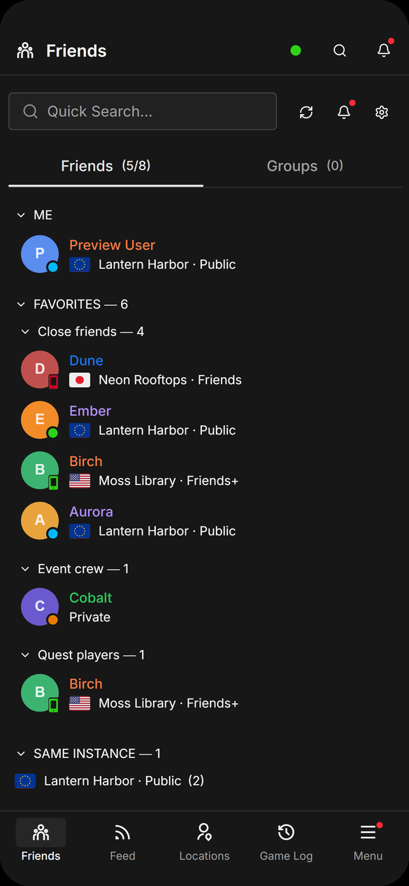
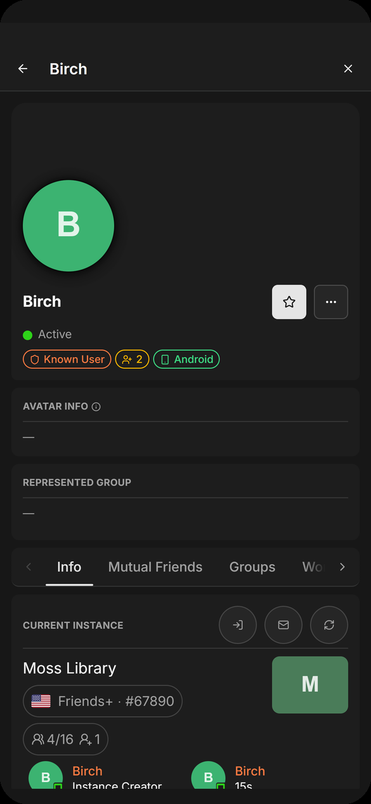
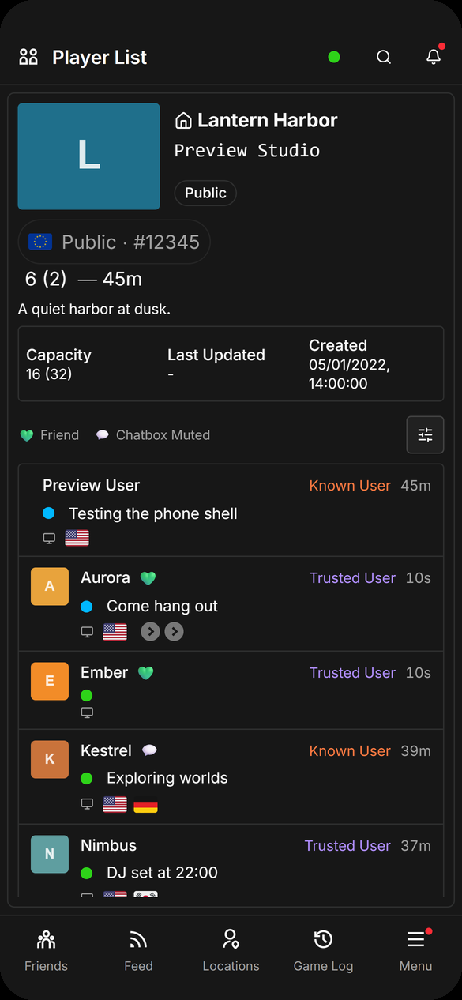
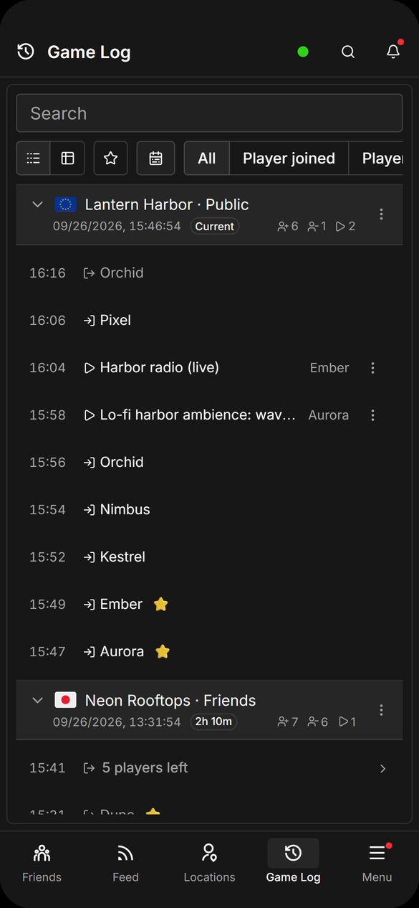
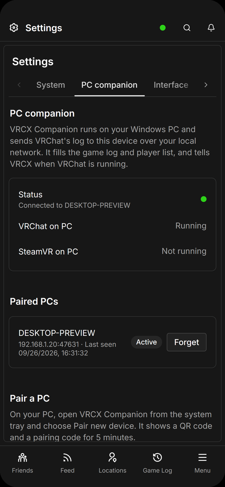
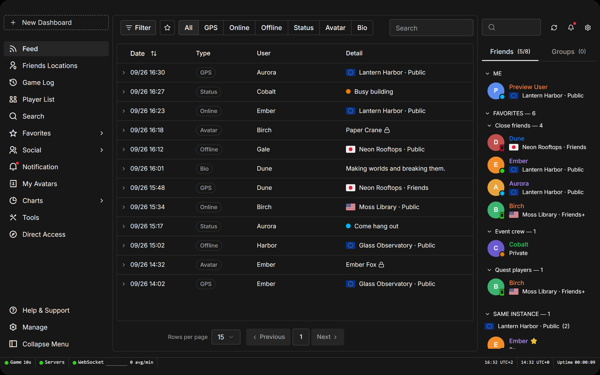
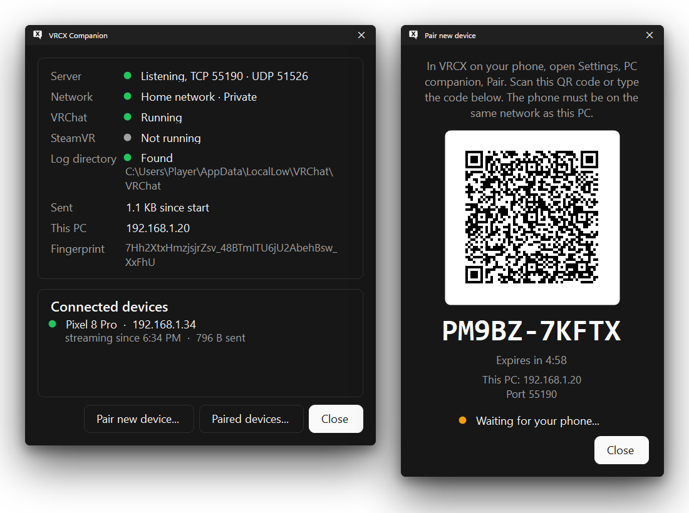

<div align="center">



# VRCX Android

**[VRCX](https://github.com/vrcx-team/VRCX), the friendship management tool for VRChat, on your phone.**

[](https://github.com/VividNightmareUnleashed/vrcx-android/releases/latest)
[](https://github.com/VividNightmareUnleashed/vrcx-android/releases)
[](https://www.virustotal.com/gui/file/35bd9bcbae4b589a7c1c2dfb66a1f10d1d64512d01ee0b896340e603655bceef)
[](https://www.virustotal.com/gui/file/79c00abe9d74de242ae573516edc441ee07f73aebd7de8a2f58dfc91bd6da7bf)
[-1b2838?logo=android&logoColor=3DDC84)](https://developer.android.com/about/versions/oreo)
[](https://kotlinlang.org)
[](https://dotnet.microsoft.com/download/dotnet/8.0)

**[Download the latest release](https://github.com/VividNightmareUnleashed/vrcx-android/releases/latest)**

</div>

VRCX Android runs VRCX itself, with its own interface and features, on Android, and folds the desktop layout to fit
a phone. Because it's VRCX's own frontend, new VRCX releases can be brought to Android with little work. A small
companion on your gaming PC sends VRChat's log to the phone over your home network, so
the game log and player list work too.

|  |  |  |
| :---: | :---: | :---: |
| The feed | Friends, grouped as on the PC | Profiles and instances |
|  |  |  |
| Player list, from the companion | Game log, from the companion | Pairing the PC companion |

## Features

**Everything VRCX does with the VRChat API.** Friends list and Friends Locations, the feed, notifications and invites,
user, world, avatar, group and instance dialogs, search, favorites, the gallery, moderation, charts and tools, backed by
VRCX's local database with your feed and friend log history.

**Made for a phone.** An app bar, a dock with Friends, your first three navigation entries and Menu, and the friends
panel sliding in from the right. Tables turn into cards, and every control is sized for a finger. Tablets get the full
desktop layout:



**The game log on your phone.** With the Windows companion running, VRChat's log reaches the phone as it's written. You
get the game log, the player list and your current instance, and notifications can depend on whether you're in VR.

**Your PC history comes along.** Settings → PC companion → Import VRCX database brings over `VRCX.sqlite3` and
`VRCX.json` from VRCX on your PC.

**Light on the battery.** In the background, VRCX keeps its VRChat connection open while you're signed in, as it does in
the PC tray, without wake locks or polling of its own. Turn it off in Settings → System.

**Android where it counts.** VRCX notifications arrive as Android notifications, with text-to-speech if you want it.
`vrchat://`, `vrcx://` and vrchat.com links open in the app, the Screenshot Metadata tool reads your phone's photos,
and prints, stickers and emoji save to Pictures/VRCX.

Not on Android: the VR overlay and wrist feed, Discord Rich Presence, launching VRChat on the PC, registry backup and
the PC folder shortcuts. They're hidden rather than left broken.

## Install

### Android

1. Download `VRCX-Android-<version>.apk` from the
   [latest release](https://github.com/VividNightmareUnleashed/vrcx-android/releases/latest) on your phone.
2. Open it, and let your browser or file manager install apps when Android asks.

Android 8.0 or later. Coming from VRCX Android 1.x? 2.0 installs over it as an update; sign in again afterwards.

### Windows companion (optional)

1. Install the [.NET 8 Desktop Runtime](https://dotnet.microsoft.com/download/dotnet/8.0) if you don't have it.
2. Download `VRCX-Companion-<version>.exe` from the same release and run it. It lives in the system tray. Windows
   SmartScreen may warn about a new, unsigned program: choose **More info**, then **Run anyway**.
3. On the phone, open Settings → PC companion → Pair. On the PC, right-click the tray icon and choose
   **Pair new device**, then scan the QR code or type the code.



The companion only talks to devices on your local network, over TLS pinned when you pair. It sends VRChat's log files
and whether VRChat and SteamVR are running, nothing else, and it makes no connections of its own.
[docs/PROTOCOL.md](docs/PROTOCOL.md) has the details.

## Verify your download

Every release lists the SHA-256 of both files, in its notes and in `SHA256SUMS.txt`, with a VirusTotal report for
each. Check a file with `Get-FileHash .\<file> -Algorithm SHA256` on Windows, or `sha256sum -c SHA256SUMS.txt`.

Every APK is signed with the same key, with this certificate SHA-256 fingerprint:

```
00:B8:35:DB:93:F5:58:F7:77:D4:A8:93:05:6F:3E:F6:07:EF:3D:41:3F:44:1F:89:B3:75:D9:7D:AD:FF:53:B4
```

`apksigner verify --print-certs <apk>` shows it, as do apps like AppVerifier. Only download VRCX Android from this
repository's releases.

## Building

You need Node 24, JDK 17, the Android SDK (platform 35) and, for the companion, the .NET 8 SDK on Windows.

```powershell
# The page, into web/build/android (the APK picks it up from there)
cd web
$env:ELECTRON_SKIP_BINARY_DOWNLOAD = 1; npm ci --ignore-scripts
npm run build:android

# The debug APK, in android/app/build/outputs/apk/debug
cd ..\android
.\gradlew.bat assembleDebug

# The companion, a single VrcxCompanion.exe in dist/companion
cd ..
dotnet publish companion/VrcxCompanion -c Release -r win-x64 --no-self-contained -p:SelfContained=false -p:PublishSingleFile=true -o dist/companion
```

Tests: `npm test` in `web/`, `gradlew testDebugUnitTest` in `android/`, and
`dotnet test companion/VrcxCompanion.sln`.

## Documentation

- [ARCHITECTURE.md](docs/ARCHITECTURE.md): how the app is put together, and what each PC-only feature became.
- [DESIGN.md](docs/DESIGN.md): the phone and tablet layouts.
- [PROTOCOL.md](docs/PROTOCOL.md): the companion protocol, pairing and security.

## License

VRCX Android is source-available: you can build and change it for your own use, but redistributing it needs
permission first and selling it isn't allowed. See [LICENSE](LICENSE) for the exact terms.

The VRCX frontend in `web/`, Copyright (c) 2019-2026 pypy and individual contributors, stays under its original MIT
License, included in `LICENSE` and `web/LICENSE`.
[THIRD-PARTY-NOTICES.txt](THIRD-PARTY-NOTICES.txt) lists the other components and their licenses.

## Credits

VRCX is made by [pypy](https://github.com/pypy-vrc), [Natsumi](https://github.com/Natsumi-sama),
[Map1en](https://github.com/Map1en) and [its contributors](https://github.com/vrcx-team/VRCX/graphs/contributors). The
Android robot in the icon is reproduced or modified from work created and shared by Google and used according to terms
described in the Creative Commons 3.0 Attribution License.

VRCX Android is not affiliated with VRChat Inc. or the VRCX team. The screenshots show the app's and the companion's
preview modes, with made-up users and addresses.
